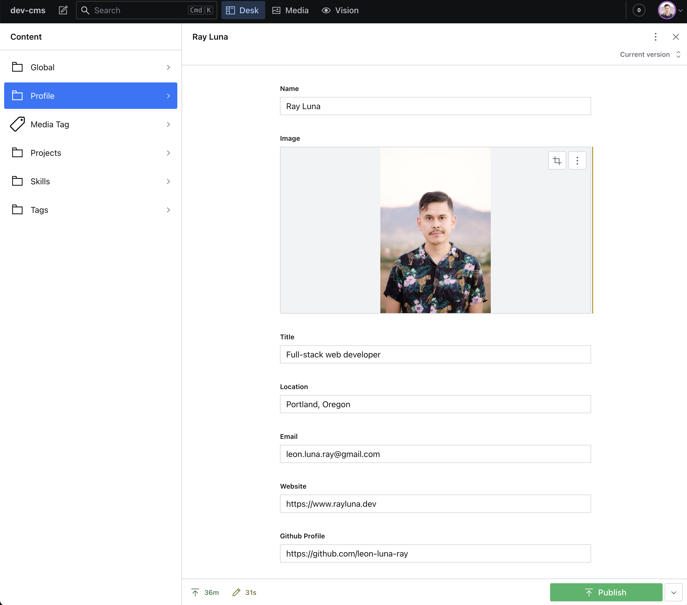

# Developer Portfolio Sanity Studio CMS

Code for Sanity.io CMS for my developer portfolio content. The Sanity Studio provides content to my developer portfolio projects via API and the GROQ query languge.

This CMS powers these projects:

- [Prework About Me](https://prework-about-me.netlify.app/)
- [Bootstrap Portfolio](https://bootstrap-portfolio-rldev.netlify.app/)
- [Materialize Portfolio](https://rldev-html-portfolio.netlify.app/)

## Technologies
- TypeScript
- JavaScript
- Sanity
- GROQ
- Yarn

## Studio Desk

